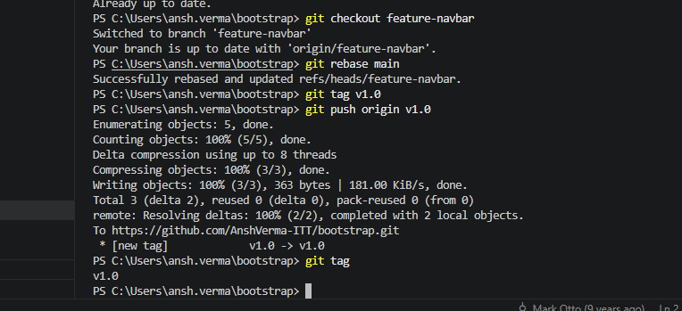

# Assignment – 1
## Git Assignment: Collaborate and Manage a Project

**Name:** Ansh Verma  

**Repository Link:**  
🔗 https://github.com/AnshVerma-ITT/SDET_Ansh_Verma

**Bootstrap Repository Link:**  
🔗 https://github.com/AnshVerma-ITT/bootstrap

---

# Objective

The objective of this assignment is to practice and demonstrate the use of essential Git and GitHub commands used in real-world software development projects.

## Commands Covered

- Fork
- Clone
- Branch Creation
- Checkout
- Add
- Commit
- Push
- Pull Request
- Stash
- Merge
- Cherry-Pick
- Rebase
- Tag Creation

---

# 1. Git Installation and Configuration

Commands used:

```bash
git config --global user.name "Ansh Verma"
git config --global user.email "ansh.verma@intimetec.com"
git config --list
```

**Description:**

- `git config --global user.name` sets the Git username.
- `git config --global user.email` sets the email associated with commits.
- `git config --list` displays all Git configurations.

The following screenshot shows the successful configuration of Git.


---

# 2. Original Bootstrap Repository

The following screenshot shows the original Bootstrap repository used for this assignment.


---

# 3. Forked Repository

The Bootstrap repository was forked into my GitHub account.


---

# 4. Repository Cloning

Command used:

```bash
git clone https://github.com/AnshVerma-ITT/bootstrap.git
```

**Description:**

`git clone` creates a local copy of the remote repository on the local machine.

The following screenshot shows the successful cloning of the repository.


---

# 5. Opening Project in Visual Studio Code

The cloned Bootstrap project was opened in Visual Studio Code.


---

# 6. Feature Branch Creation

Command used:

```bash
git checkout -b feature-navbar
```

**Description:**

This command creates a new branch named `feature-navbar` and automatically switches to it.

The following screenshot shows the successful creation of the feature branch.


---

# 7. Modifying README.md

The README file was modified for practice purposes.

The following screenshot shows the updated README file.


---

# 8. Checking Git Status

Command used:

```bash
git status
```

**Description:**

Displays the current state of the working directory and staging area, including modified and untracked files.


---

# 9. Adding and Committing Changes

Commands used:

```bash
git add .
git commit -m "modified readme for practice"
```

**Description:**

- `git add .` stages all modified files.
- `git commit` records the staged changes into the local repository.

The following screenshot shows the successful commit.


---

# 10. Pushing Feature Branch

Command used:

```bash
git push -u origin feature-navbar
```

**Description:**

Pushes the local branch and its commits to the remote GitHub repository.

The following screenshot shows the successful push operation.


---

# 11. Compare and Pull Request

After pushing the branch, GitHub automatically displayed the Compare & Pull Request option.


---

# 12. Raising Pull Request

A Pull Request was created to merge feature branch changes.


---

# 13. Hotfix Branch Creation

Command used:

```bash
git checkout -b hotfix-readme
```

**Description:**

Creates a new branch named `hotfix-readme` and switches to it.

The following screenshot shows the successful creation of the hotfix branch.


---

# 14. Modifying README.md for Hotfix

Modifications were made to README.md in hotfix-readme branch.


---

# 15. Commit and Push Hotfix Branch

Commands used:

```bash
git add .
git commit -m "hotfix readme change"
git push -u origin hotfix-readme
```

**Description:**

These commands stage, commit, and push hotfix-readme changes to GitHub.

The following screenshots show the successful operations.


---

# 16. Compare and Pull Request for Hotfix

GitHub displayed the Compare & Pull Request option for the hotfix branch.


---

# 17. Raising Hotfix Pull Request

A Pull Request was created for the hotfix branch.


---

# 18. Git Stash Operations

Commands used:

```bash
git stash
git stash list
git stash pop
```

**Description:**

- `git stash` temporarily saves uncommitted changes.
- `git stash list` displays all stashed changes.
- `git stash pop` restores the latest stash and removes it from the stash list.

This feature is useful when switching branches without committing unfinished work.


---

# 19. Merge Operation

Commands used:

```bash
git checkout main
git merge feature-navbar
```

**Description:**

- `git checkout main` switches to the main branch.
- `git merge feature-navbar` combines the commits from the feature branch into the main branch.

Merge preserves the complete history of both branches.


---

# 20. Cherry-Pick Operation

Commands used:

```bash
git log --oneline
git cherry-pick 15dfe0154
```

**Description:**

- `git log --oneline` displays commit history in a compact format and helps identify commit IDs.
- `git cherry-pick <commit-id>` applies a specific commit from another branch into the current branch without merging the entire branch.

Cherry-pick is useful when only selected changes are required.


---

# 21. Rebase Operation

Command used:

```bash
git rebase main
```

**Description:**

`git rebase main` takes the commits from the current branch and reapplies them on top of the latest commits from the `main` branch.

During rebase, the commits from `main` come first, followed by the commits of the current branch. This helps maintain a clean and linear commit history compared to merge.


---

# 22. Tag Creation

Commands used:

```bash
git tag v1.0
git push origin v1.0
```

**Description:**

- `git tag v1.0` creates a tag named `v1.0`.
- `git push origin v1.0` pushes the tag to GitHub.

Tags are commonly used to mark important releases or versions of a project.




---

# Conclusion

This assignment provided hands-on experience with Git and GitHub workflows commonly used in collaborative software development environments.

Through this assignment, I learned:

- Repository forking and cloning
- Branch creation and management
- Staging, committing, and pushing changes
- Creating Pull Requests for collaboration
- Temporarily saving work using Git Stash
- Integrating changes using Merge
- Applying specific commits using Cherry-Pick
- Maintaining a clean history using Rebase
- Managing releases using Git Tags

Overall, this assignment improved my understanding of practical version control workflows and increased my confidence in using Git for real-world software development and team collaboration.