# Assignment – 1
## Git Assignment: Collaborate and Manage a Project

**Name:** Ansh Verma  

**Repository Link:**  
🔗 https://github.com/AnshVerma-ITT/SDET_Ansh_Verma

**Bootstrap Repository Link:**  
🔗 https://github.com/AnshVerma-ITT/bootstrap

---

# Objective

The objective of this assignment is to practice and demonstrate the use of essential Git and GitHub commands used in real-world software development projects.

## Commands Covered

- Fork
- Clone
- Branch Creation
- Checkout
- Add
- Commit
- Push
- Pull Request
- Stash
- Merge
- Cherry Pick
- Rebase
- Tag Creation

---

# 1. Installing Git and Configuring Username & Email

Configured Git username and email using:

```bash
git config --global user.name "Ansh Verma"
git config --global user.email "ansh.verma@intimetec.com"
git config --list
```

---

# 2. Original Bootstrap Repository


---

# 3. Forked Repository

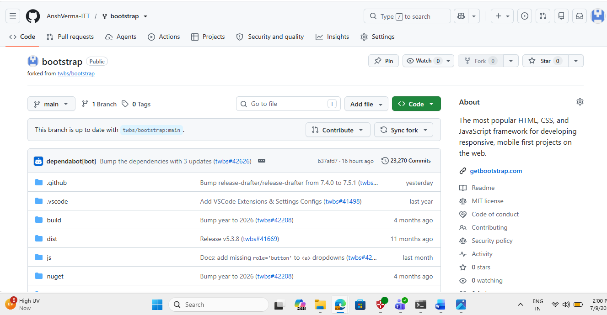

---

# 4. Cloning the Repository

```bash
git clone https://github.com/AnshVerma-ITT/bootstrap.git
```


---

# 5. Opening Bootstrap Project in VS Code

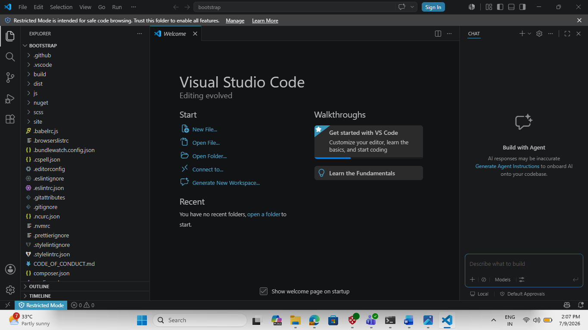

---

# 6. Creation of Feature Branch

```bash
git checkout -b feature
```

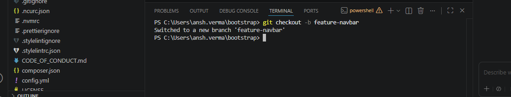

---

# 7. Edited README.md


---

# 8. Checking Git Status

```bash
git status
```


---

# 9. Adding and Committing Changes

```bash
git add .
git commit -m "Updated README in feature branch"
```


---

# 10. Pushing Feature Branch

```bash
git push origin feature
```
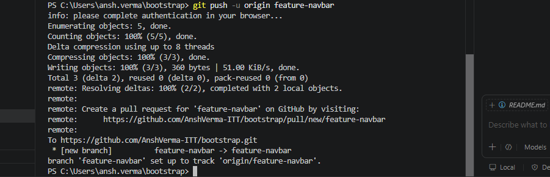

---

# 11. Compare & Pull Request

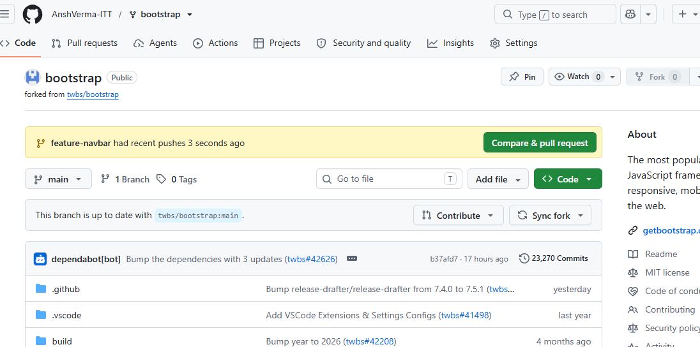

---

# 12. Raising Pull Request

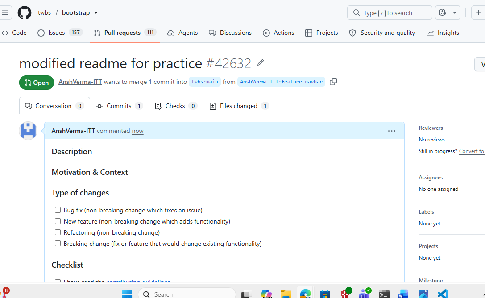

---

# 13. Creation of Hotfix Branch

```bash
git checkout -b hotfix
```

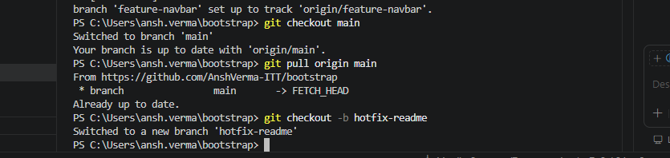

---

# 14. Modified README.md for Hotfix


---

# 15. Commit and Push Hotfix Branch

```bash
git add .
git commit -m "Hotfix changes"
git push origin hotfix
```

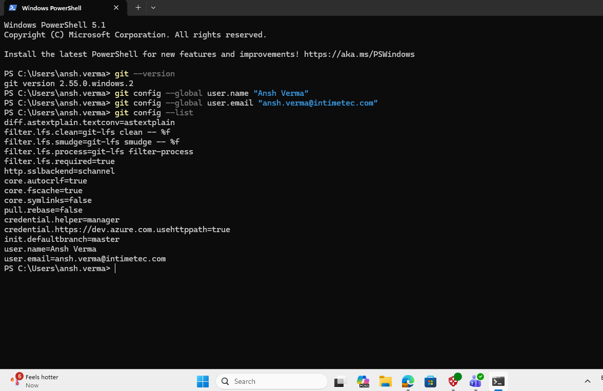


---

# 16. Compare & Pull Request for Hotfix

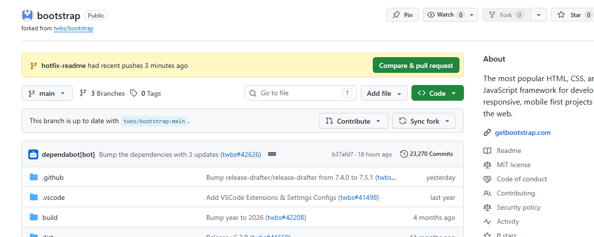

---

# 17. Raising Hotfix Pull Request


---

# 18. Git Stash

Commands used:

```bash
git stash
git stash list
git stash pop
```


---

# 19. Merge Feature Branch into Main

```bash
git checkout main
git merge feature
```

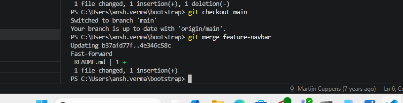

---

# 20. Cherry Pick

```bash
git log --oneline
git cherry-pick <commit-id>
```

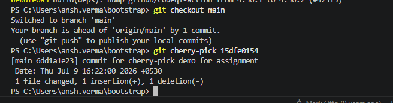

---

# 21. Git Rebase

```bash
git rebase main
```


---

# 22. Creating and Pushing Tag

```bash
git tag v1.0
git push origin v1.0
```


---

# Conclusion

This assignment provided practical experience with the following Git concepts:

- Repository Forking
- Repository Cloning
- Branch Creation and Switching
- Git Status
- Staging Changes
- Commit and Push
- Pull Requests
- Git Stash
- Merge
- Cherry Pick
- Rebase
- Tag Creation and Push

The assignment helped in understanding a complete Git workflow commonly followed in collaborative software development projects.