# Assignment – 1
## Git Assignment: Collaborate and Manage a Project

**Name:** Ansh Verma  
**Employee ID:** ITTV/EMP/3980  

**Repository Link:**  
🔗 https://github.com/AnshVerma-ITT/SDET_Ansh_Verma_training

**Bootstrap Repository Link:**
🔗 https://github.com/AnshVerma-ITT/bootstrap

---

# Objective

The objective of this assignment is to practice and demonstrate the use of essential Git and GitHub commands used in real-world software development projects.

Commands covered:

- Fork
- Clone
- Branch Creation
- Checkout
- Add
- Commit
- Push
- Pull Request
- Stash
- Merge
- Cherry Pick
- Rebase
- Tag Creation

---

# 1. Installing Git and Configuring Username & Email

Configured Git username and email using:

```bash
git config --global user.name "Ansh Verma"
git config --global user.email "ansh.verma@intimetec.com"

git config --list
```

---

# 2. Original Bootstrap Repository

The original Bootstrap repository used for this assignment.

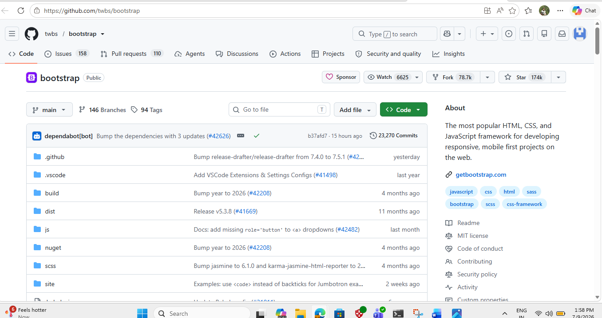

---

# 3. Forked Repository

Forked the original repository into my GitHub account.


---

# 4. Cloning the Repository

Cloned the forked repository into the local machine.

```bash
git clone https://github.com/AnshVerma-ITT/bootstrap.git
```

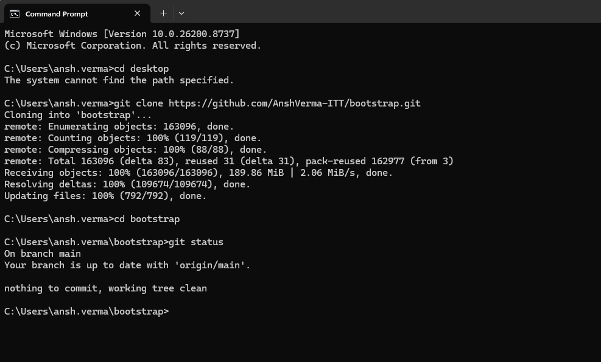

---

# 5. Opening Project in VS Code

Bootstrap project opened successfully in Visual Studio Code.


---

# 6. Creation of Feature Branch

Created a new feature branch.

```bash
git checkout -b feature
```


---

# 7. Editing README File

Modified `README.md` for practice purposes.

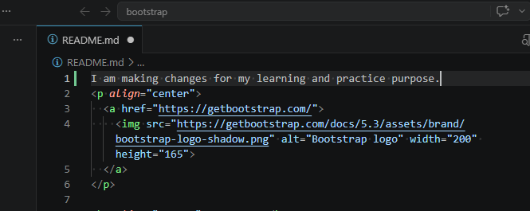

---

# 8. Checking Git Status Before Adding Files

Checked the status of modified files.

```bash
git status
```

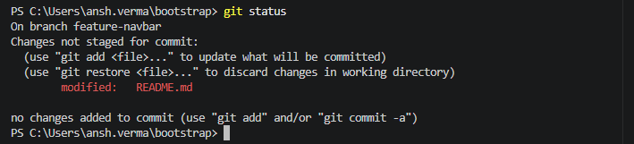

---

# 9. Adding and Committing Files

Added changes and committed them.

```bash
git add .
git commit -m "Updated README in feature branch"
```

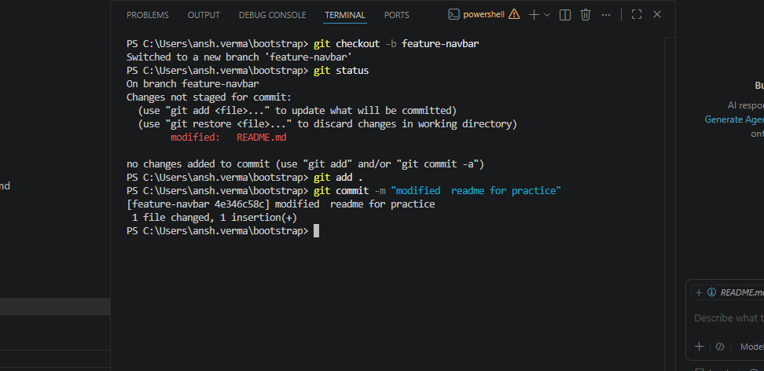

---

# 10. Pushing Feature Branch

Pushed the feature branch to GitHub.

```bash
git push origin feature
```


---

# 11. Compare and Pull Request Page

GitHub automatically displayed the Compare & Pull Request option.


---

# 12. Raising Pull Request

Created a Pull Request from the feature branch.


---

# 13. Creation of Hotfix Branch

Created a hotfix branch.

```bash
git checkout -b hotfix
```


---

# 14. Edited README File for Hotfix Changes

Made additional modifications in README.

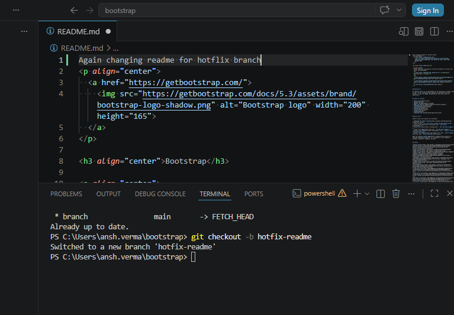

---

# 15. Adding, Committing and Pushing Hotfix Branch

```bash
git add .
git commit -m "Hotfix changes"
git push origin hotfix
```


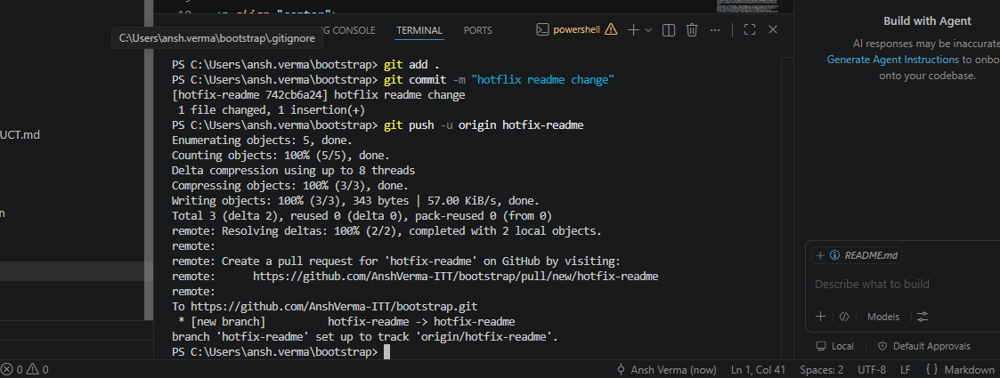

---

# 16. Compare and Pull Request for Hotfix Branch

GitHub displayed the Compare & Pull Request option.


---

# 17. Raising Pull Request for Hotfix

Created Pull Request for the hotfix branch.

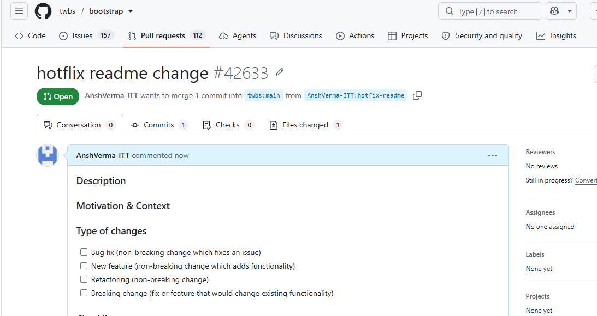

---

# 18. Git Stash Commands

Practiced stash operations.

Commands used:

```bash
git stash
git stash list
git stash pop
```

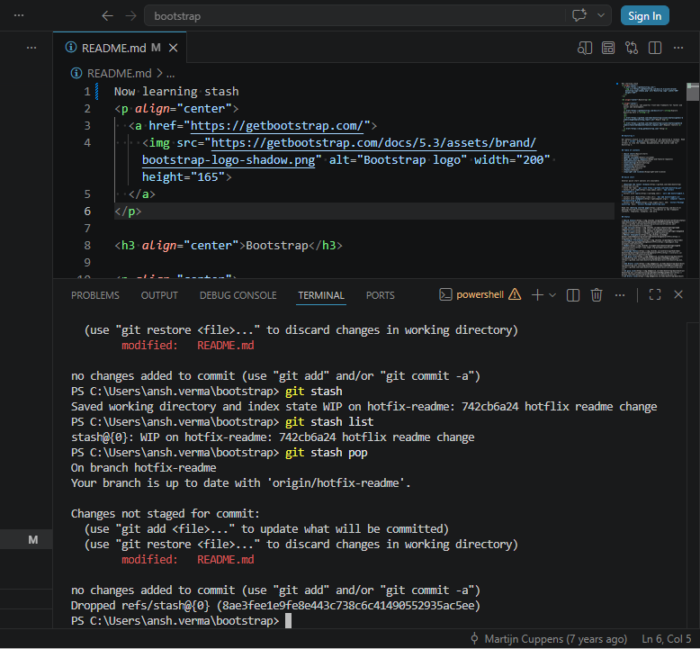

---

# 19. Merging Feature Branch into Main

Merged feature branch changes into the main branch.

```bash
git checkout main
git merge feature
```


---

# 20. Cherry Pick Operation

Used `git log --oneline` to find commit hashes and applied specific commits.

```bash
git log --oneline
git cherry-pick <commit-id>
```


---

# 21. Git Rebase

Replayed commits on top of the latest main branch.

```bash
git rebase main
```

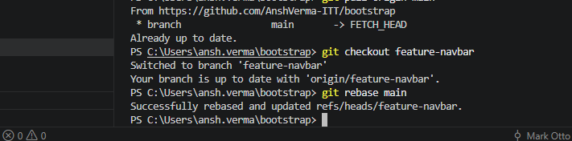

---

# 22. Creating and Pushing Tags

Created a tag and pushed it to GitHub.

```bash
git tag v1.0
git push origin v1.0
```

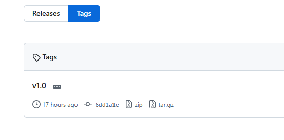

---

# Conclusion

Through this assignment, I successfully learned and practiced the following Git concepts:

✅ Repository Forking  
✅ Repository Cloning  
✅ Branch Creation and Switching  
✅ Git Status and Staging  
✅ Commit and Push Operations  
✅ Pull Requests  
✅ Git Stash  
✅ Merge Operations  
✅ Cherry Pick  
✅ Git Rebase  
✅ Tag Creation and Push  

This assignment provided hands-on experience with version control workflows commonly used in software development teams.

---

## GitHub Repository

🔗 https://github.com/AnshVerma-ITT/SDET_Ansh_Verma_training