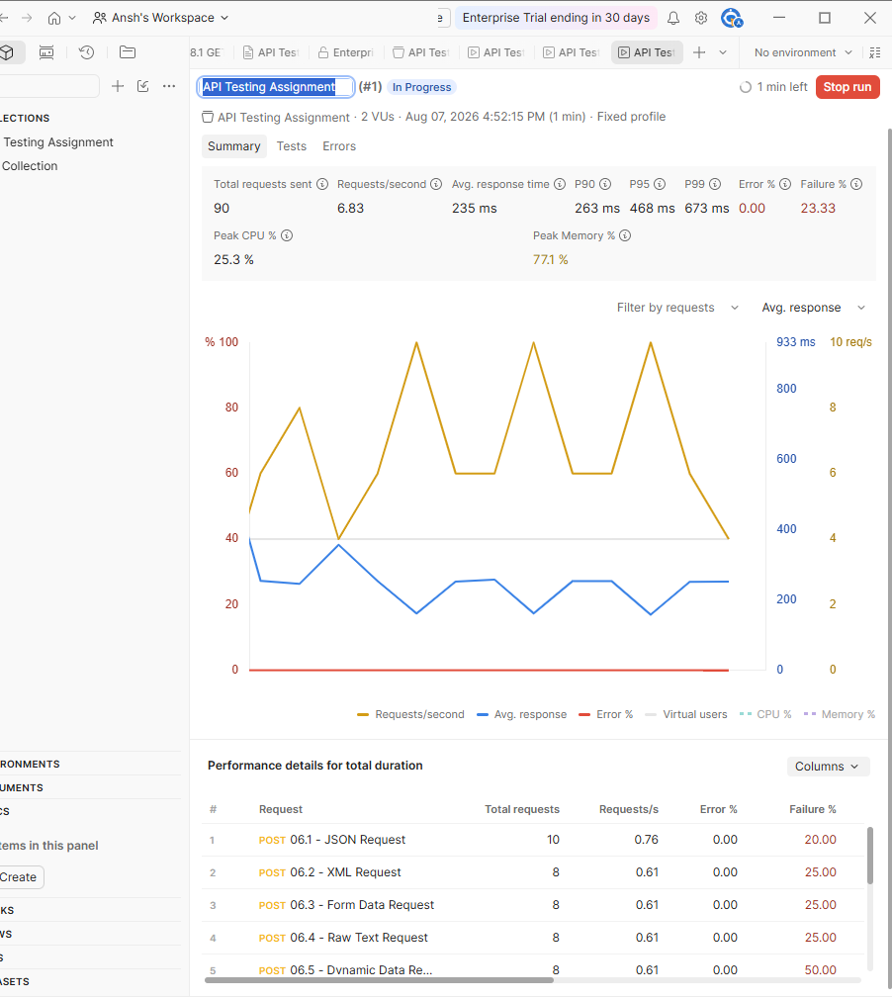

# API Testing Assignment - Postman Documentation

**Created by: Ansh Verma**

## Collection

The Postman collection created for this assignment demonstrates API testing using the ReqRes API and Postman.

## Published API Documentation

[View API Testing Assignment Documentation](https://ansh-verma-e52fd6d9-7492431.postman.co/workspace/583726e8-097e-4bed-8ae6-75188a363051/documentation/57182481-4733996b-fc49-4b3d-bef2-4a9c9b7d648f)

## API Used

ReqRes API:

[https://reqres.in/](https://reqres.in/)

## Authentication

The ReqRes API requires an API key.

The API key is passed through the request header:

`x-api-key`

The actual API key is stored as a variable and is not included in this documentation.

## Topics Covered

- REST API
- HTTP protocol
- GET
- POST
- PUT
- PATCH
- DELETE
- HTTP status codes
- API key authentication
- Parameters
- JSON request body
- XML request body
- Form-data
- Raw text
- Response validation
- Dynamic data
- API chaining
- API mocking
- API documentation
- Test isolation
- Parallel execution

## Collection Structure

### Basic API Requests

- GET Users
- POST Create User
- PUT Update User
- PATCH Update User
- DELETE User

### Content Type Tests

- JSON
- XML
- Form-data
- Raw text
- Dynamic data

### API Chaining

- Create User for Chaining
- Get Chained User
- Get User Using Chained Variable

### Mock API

- GET/POST Mock User

## Test Results

The functional collection run was completed successfully with:

- 39 tests
- 39 passed
- 0 failed
- 0 errors

A separate performance/parallel execution was also performed using 2 virtual users.

## Parallel Execution

A performance test was executed using **2 virtual users** to demonstrate parallel execution.

