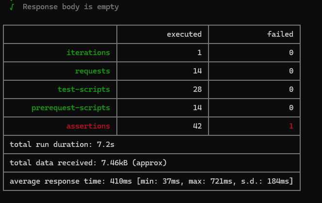

# API Testing Assignment - Postman Documentation

**Created by: Ansh Verma**

## Collection

The Postman collection created for this assignment demonstrates API testing using the ReqRes API and Postman.

## Published API Documentation

[View API Testing Assignment Documentation](https://ansh-verma-e52fd6d9-7492431.postman.co/workspace/583726e8-097e-4bed-8ae6-75188a363051/documentation/57182481-4733996b-fc49-4b3d-bef2-4a9c9b7d648f)

## API Used

ReqRes API:

[https://reqres.in/](https://reqres.in/)

## Authentication and Authorization

The ReqRes API requires an API key.

The API key is passed through the request header:

`x-api-key`

Authorization using the API key is configured through Postman's **Authorization** tab for the main API requests.

The actual API key is stored as a variable and is not included in this documentation.

## Environments

Two Postman environments were created:

- **Development**
- **Production**

Environment variables are used for values such as:

- `baseUrl`
- `apiKey`
- `userId`
- `testName`
- `testJob`
- `requestTimestamp`

This avoids hardcoding environment-specific values in requests and scripts.

## Topics Covered

- REST API
- HTTP protocol
- GET
- POST
- PUT
- PATCH
- DELETE
- HTTP status codes
- API key authentication and authorization
- Parameters
- JSON request body
- XML request body
- Form-data
- Raw text
- Response validation
- Dynamic data management
- Pre-request scripts
- Environment variables
- Development and Production environments
- API chaining
- API mocking
- API documentation
- Test isolation
- Parallel execution
- Newman CLI execution

## Collection Structure

### Basic API Requests

- GET Users
- POST Create User
- PUT Update User
- PATCH Update User
- DELETE User

Authorization is configured for the main API requests using the ReqRes API key.

### Content Type Tests

- JSON
- XML
- Form-data
- Raw text
- Dynamic data

### API Chaining

- Create User for Chaining
- Get Chained User
- Get User Using Chained Variable

The `07.1` request extracts the generated user ID from the response and stores it in the `createdUserId` collection variable.

The `07.2` request uses `{{createdUserId}}` in the GET URL.

For the chaining test, the expected backend response is **HTTP 204 No Content**, while the current backend returns **HTTP 404 Not Found**. This test is intentionally retained to demonstrate and report the backend-side issue.

### Mock API

- GET/POST Mock User
- Postman Mock Server
- Sample JSON response

## Pre-request Script

A pre-request script was added to the POST Create User request.

The script generates a dynamic request timestamp and stores it in the `requestTimestamp` environment variable before the request is sent.

## Test Results

The functional collection contains the configured response and validation tests.

The `07.2 - Get Chained User` test is intentionally expected to fail because it demonstrates the identified backend-side issue:

- Expected status: **204 No Content**
- Actual status: **404 Not Found**

All other tests are expected to execute according to their configured assertions.

## Newman Execution

The collection was also executed using **Newman** from the command line.

Newman was used to execute the exported Postman collection outside the Postman UI and to support automated command-line execution.

## Parallel Execution

A separate performance test was executed using **2 virtual users** to demonstrate concurrent/parallel execution.

The Newman execution and the 2-virtual-user performance execution are treated as separate execution activities:

- **Newman** — command-line collection execution

- **2 Virtual Users** — concurrent/performance execution

